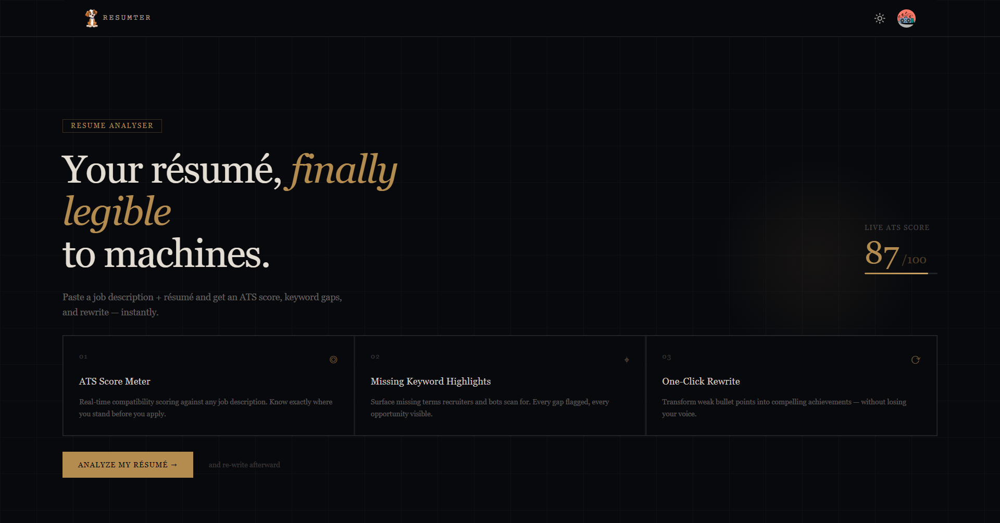
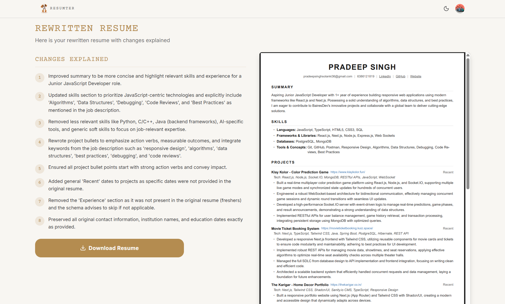

# AI Resume Analyser - Resumter



A powerful and modern web application built with Next.js that leverages AI to help job seekers analyze and optimize their resumes to match their career goals.

## ✨ Features

- **AI-Powered Analysis**: Upload your resume and receive instant, actionable feedback powered by Google Generative AI to identify strengths and areas for improvement.
- **Smart Rewrites**: Automatically generate improved, professional versions of your resume content, tailored to highlight your specific skills and experiences.
- **PDF Generation**: Easily preview and download your rewritten, perfectly-formatted resume directly as a PDF document.



- **Secure Authentication**: Seamless and safe user login, session management, and data protection powered by Clerk.
- **Modern & Responsive UI**: A fully responsive, accessible, and sleek interface complete with Light and Dark mode support, designed with Tailwind CSS and Shadcn UI.
- **Analysis History**: Keep track of your past resume analyses and rewrites through a personalized dashboard.

## 🛠️ Tech Stack

- **Framework**: [Next.js](https://nextjs.org/) (App Router)
- **Language**: TypeScript
- **Database**: PostgreSQL (via [Supabase](https://supabase.com/))
- **ORM**: [Prisma](https://www.prisma.io/)
- **AI & ML**: [Vercel AI SDK](https://sdk.vercel.ai/) & Google Generative AI
- **Authentication**: [Clerk](https://clerk.com/)
- **Styling**: Tailwind CSS & [Shadcn UI](https://ui.shadcn.com/)

## 🚀 Getting Started

Follow these steps to set up the project locally.

### Prerequisites

Make sure you have the following installed:
- Node.js (v18 or higher)
- pnpm (recommended) or npm/yarn
- A Supabase account (for the PostgreSQL database)
- A Clerk account (for authentication)
- A Google Gemini API Key

### Installation

1. **Clone the repository** (if applicable) and navigate to the project directory:
   ```bash
   cd 01-ai-resume-analyser
   ```

2. **Install dependencies**:
   ```bash
   pnpm install
   ```

3. **Set up Environment Variables**:
   Create a `.env` file in the root directory and add your API keys. You can use `.env.example` as a reference if available.
   ```env
   # Clerk Auth configuration
   NEXT_PUBLIC_CLERK_PUBLISHABLE_KEY=your_clerk_publishable_key
   CLERK_SECRET_KEY=your_clerk_secret_key
   
   # Supabase / Prisma Database URLs
   DATABASE_URL="your_supabase_postgresql_connection_string"
   
   # Google AI
   GOOGLE_GENERATIVE_AI_API_KEY=your_google_ai_api_key
   ```

4. **Initialize the Database**:
   Push the Prisma schema to your Supabase database and generate the Prisma Client:
   ```bash
   npx prisma generate
   npx prisma db push
   ```

5. **Run the development server**:
   ```bash
   pnpm dev
   ```

6. **View the app**:
   Open [http://localhost:3000](http://localhost:3000) in your browser to see the application in action.

## 📄 License

This project is licensed under the [MIT License](LICENSE).
